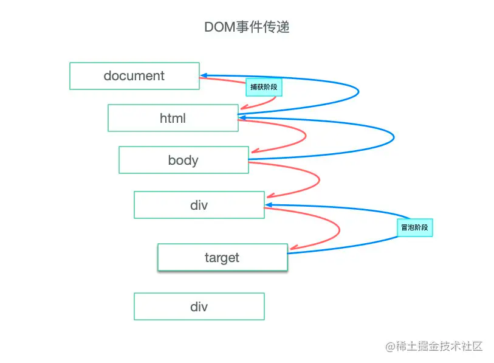

## 事件传递

事件产生后，从window对象自上而下向目标节点传递，抵达目标节点后会沿着相反方向传递



### 事件捕获与冒泡
根据事件传递中的两种传递路径分别分为：由上至下——事件捕获阶段，由下至上——事件冒泡阶段，指的是一个事件由window（上图并未标出window）到target之间的传递的过程。

### 捕获冒泡的应用

eg:
```html
<div id="div1">
  <button id="button1">button</button>
</div>
```
```js
var div1 = document.getElementById('div1')
var button1 = document.getElementById('button1')
div.addEventListener('click', (e) => {
    console.log(e.currentTarget)
}, true)
// addEventListener第三个参数为true，表示：在捕获阶段调用处理函数。
// addEventListener第三个参数为false，表示：在冒泡阶段调用处理函数。

button1.addEventListener('click', (e) => {
    console.log(e.currentTarget)
    e.stopPropagation() // 阻止事件冒泡, 即冒泡阶段不会触发父node div的click事件
}, false)
```
点击button的打印：div,button 元素

### 事件委托
每注册一个事件监听器都需要使用一定内存，同时在dom节点多了之后事件经过的捕获、冒泡阶段要处理更多DOM节点，事件传递也就不够高效了。

原理：
父节点嵌套的子节点的触发的事件会通过事件冒泡到达父节点，事件处理程序不直接绑定到子节点，统一由公共父节点进行事件监听。

注意：
+ e.target表示**触发事件的元素**，通过e.target可以判断具体响应那个元素的事件
+ e.currentTarget表示**事件监听器绑定的元素**，在事件委托情况下指向同一个元素

```js
<!-- 省略了部分代码 -->
<div id="div1">
  <button id="button1">button</button>
</div>
<script>
  document.addEventListener('click', (e) => {
    // e.target：触发事件的元素
    // e.currentTarget：事件监听器绑定的元素
    // console.log(e.target, e.currentTarget)
    if (e.target.id === 'button1') {
      console.log('button1 clicked')
    }
    if (e.target.id === 'div1') {
      console.log('div1 clicked')
    }
    if (e.target.tagName === 'HTML') {
      console.log('html clicked')
    }
    if (e.target.tagName === 'BODY') {
      cosnole.log('body clicked')
    }
  })
</script>
```
