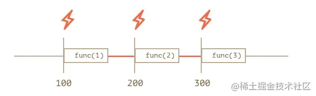
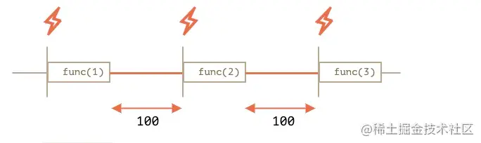

## setInterval 和setTnterval 的区别

setInterval




setTimeout实现的setInterval



+ 可以看到setTimeout实现的间隔是不变的，而setInterval的间隔包含函数本身执行的时间
+ 当回调函数执行时间过长时，setInterval会不准。需要用setTimeout来模拟setInterval的操作

```js
// 用全局变量去保存自定义的setInterval
const timer = {}
// 实现id唯一
// let id = 0
// 模拟setInterval函数
let myInterval = function (cb, time, ...args) {
    // let timeId = id
    // 为添加多个myInterval函数时，保证id的唯一。
    // id++
    
    // 定义一个Symbol类型的timeId作为timer对象的唯一属性
    let timeId = Symbol()
    const fn = () => {
        cb.apply(undefined, args)
        // 递归调用fn
        timer[timeId] = setTimeout(fn, time)
    }
    timer[timeId] = setTimeout(fn, time)
    return timeId
}

// 模拟clearInterval函数
let myClearInterval = function (id) {
    clearTimeout(timer[id])
    delete timer[id]
}
// 用例
let myID = myInterval((v) => {console.log(v)}, 1000, 'Hello') //11 Hello
myClearInterval(myID) // 停止myInterval
```
