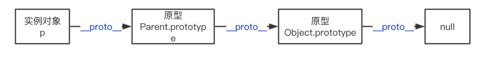
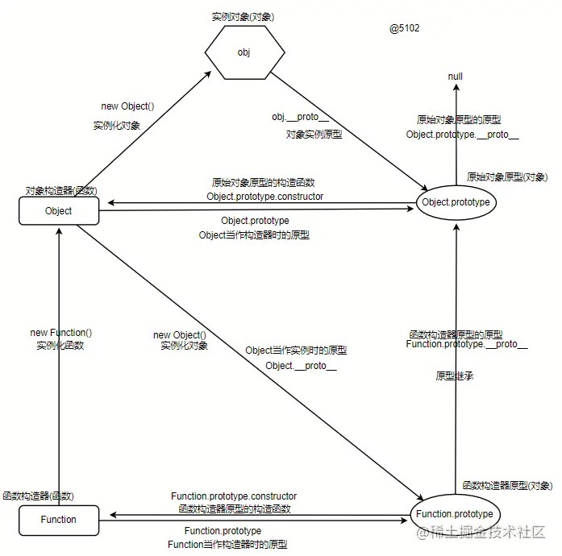

## 原型与原型链

1. __proto__属性

通过__proto__可以 获取与设置 对应构造函数的原型的引用

```js
Object.defineProperties(Object.prototype, '__proto__', {
    get() {
        // 获取引用对象的[[Prototype]]
        return Object.getPrototypeOf(this)
    },
    set(o) {
        // 设置引用对象[[Prototype]]属性关联的原型为o
        Object.setPrototypeOf(this, o)
    }
})
```

使用：通过__proto__属性实现instanceof
```js
function myInstanceof(left, right) {
    let proto = left.__proto__
   while (true) {
        if (proto === right.prototype) {
            return true
        }
        if (proto === null) {
            return false
        }
        // 向上寻找
        proto = proto.__proto__
   }
}
// 用例
myInstanceof({}, Object)
```

2. prototype属性
   
以下演示函数prototype属性在实例化时的作用
```js
function Foo() {}
// 定义Foo构造函数时，自动创建的“干净的实例原型”
console.log(Foo.prototype)

var foo = new Foo()
// 表明实例关联的原型即为构造函数的prototype指向的原型对象
console.log(foo.__proto__ === Foo.prototype) // true
```

原型相关说明：

+ 只有对象类型才有原型概念
+ 普通对象(即使用对象字面量或者Object构造器创建的对象)的原型为__proto__属性。或者可以使用es6的Reflect.getPrototypeOf(obj)和Object.getPrototypeOf(obj)方法获取对象的原型，其关系为`Reflect.getPrototypeOf({}) === Object.getPrototypeOf({}) === {}.__proto__`
+ 普通函数有2个属性，一个是是__proto__(与普通对象类似)，还有一个是函数专有的prototype属性，因为函数有双重身份，即可以是实例也可以是构造器，所以关系比较特殊.
+ `Object.prototype.__proto__ === null`
+ 箭头函数虽然属于函数，由Function产生，但是没有prototype属性没有构造器特性，所以也就没有所谓的constructor，就不能作为构造器使用

3. 原型链

```js
function Parent(age) {
    this.age = age;
}
var p = new Parent(50);

p;	// Parent {age: 50}
p.__proto__ === Parent.prototype; // true
p.__proto__.__proto__ === Object.prototype; // true
p.__proto__.__proto__.__proto__ === null; // true
```



下图展示更复杂的原型链图：



说明：
+ 所有函数都是由Function函数构造器实例化而来
+ 所有实例的原型都指向构造它的构造器的prototype
+ 每个构造器自身特有的方法就是静态方法，原型上的方法可供所有继承它或间接继承它的实例使用
+ 构造器也是函数，也是被Function实例化出来的，所以构造器的__proto__就是Function.prototype，但是构造器的prototype属性指向的原型，是此构造器实例化出来的实例所指向的原型；简单说构造器的prototype就是作为它的实例的原型

所以：`Function.prototype.__proto__.constructor.__proto__.constructor === Function // true`

4. 继承与实现
   
    1. 原型链继承
    ```js
        /* 四边形 */
        function Rectangle(length, width) {
            this.length = length   // 长
            this.width = width     // 宽
        }
        
        /* 获取面积 */
        Rectangle.prototype.getArea = function() {
            return this.length * this.width
        }
        
        /* 获取尺寸信息 */
        Rectangle.prototype.getSize = function() {
            console.log(`Rectangle: ${ this.length }x${ this.width }，面积: ${ this.getArea() }`)
        }
        
        /* 正方形 */
        function Square(size) {
            this.length = size
            this.width = size
        }
    
        // 继承实现：
        Square.prototype = new Rectangle()
        // 或者：
        Square.prototype = Object.create(Rectangle.prototype);
        // 将 Squre原型对象中的 构造器属性指向自身。
        Square.prototype.constructor = Square
        
        // 以上便完成了原型连继承。
        
        // 方法重写
        Square.prototype.getSize = function() {
        console.log(`Square: ${ this.length }x${ this.width }，面积: ${ this.getArea() }`)
        }
        
        // 实例化
        var rect = new Rectangle(5, 10)
        var squa = new Square(6)
        
        // 原型方法调用
        rect.getSize()       // Rectangle: 5x10，面积: 50
        squa.getSize()       // Square: 6x6，面积: 36
    ```
    2. 原型之间的继承
    ```js
        function Parent(){} // 定义父类构造器
        function Children(){} // 定义子类构造器
   
        // 目标：Children.prototype.__proto__ === Parent.prototype
   
        childPrototype = Children.prototype
        childPrototypeProto = Children.prototype.__proto__
   
        // 继承实现：
   
        // 1
        childPrototypeProto = Parent.prototype
        // 2
        childPrototype = Object.create(Parent.prototype)
        // 3
        Object.setPrototypeOf(childPrototype, Parent.prototype)
   
        // 最重要的：不要忘了将Children.prototype的构造器属性指向自身。
        childPrototype.constructor = Children
    ```
   
    3. 构造函数窃取
    ```js
        function Parent(name) {
            this.name = name
        }

        function Children(name, age) {
            // 构造函数使用
            Parent.call(this, name)
            this.age = age
        }
        // 实例化
        const obj = new Children('tom', 5)
    ```

    4. 对象之间的继承
    
    首先要知道：
   + 使用对象字面量形式创建对象时，会隐式指定 Object.prototype 为新对象的 [[Prototype]]
   + 使用 Object.create() 方式创建对象时，可以显式指定新对象的 [[Prototype]]。该方法接受两个参数：第一个参数为新对象的 [[Prototype]]，第二个参数描述了新对象的属性，格式如在 Object.defineProperties() 中使用的一样。
    
    eg：

    ```js
        const rectangle = {
            sizeType: '四边形',
            getSize: function() {
                console.log(this.sizeType)
            }
        }
        const square = Object.create(rectangle, {
            sizeType: { value: '正方形' }
        })
   
        rectangle.getSize() // 四边形
        square.getSize() // 正方形
   
        console.log(rectangle.hasOwnProperty('getSize')) // true
        console.log(rectangle.isPrototypeOf(square))     // true
        console.log(square.hasOwnProperty('getSize'))    // false 判断是否是自身属性
        console.log('getSize' in square)                 // true 判断是否可以遍历到
   
        // 原型链关系如下：
        square.__proto__ === rectangle // true
        square.__proto__.__proto__ === Object.prototype // true
    ```

    5. ES6 的 extends 方式实现继承
       
       ES6 中引入了 class 关键字，class 之间可以通过 extends 关键字实现继承，这比 ES5 的通过修改原型链实现继承，要清晰、方便和语义化的多。
    
    ```js
        // 四边形
        class Rectangle {
            constructor(length, width) {
                this.length = length
                this.width = width
                this.color = 'red'
            }
   
            /* 获取面积 */
             getArea() {
                 return this.length * this.width
             }
            /* 获取尺寸信息 */
            getSize() {
                console.log(`Rectangle: ${ this.length }x${ this.width }，面积: ${ this.getArea() }`)
            }
        }
        // 正方形
        class Square extends Rectangle {
            constructor(size) {
                // 父类构造器属性窃取
                super(size, size)
                // 属性重写
                this.color = 'blue'
            }
            // 方法重写
            getSize() {
                console.log(`Square: ${ this.length }x${ this.width }，面积: ${ this.getArea() }`)
            }
        }
   
        const rect = new Rectangle(5, 10)
        const squa = new Square(6)
        
        rect.getSize()       // Rectangle: 5x10，面积: 50
        squa.getSize()       // Square: 6x6，面积: 36
    ```
